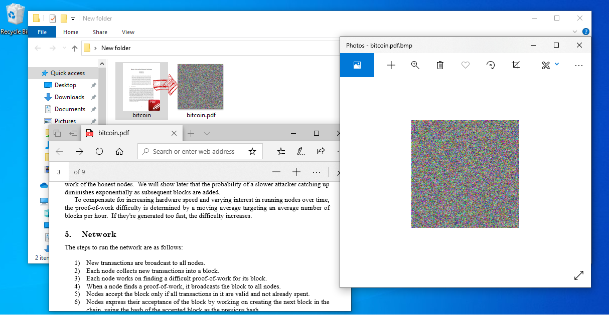
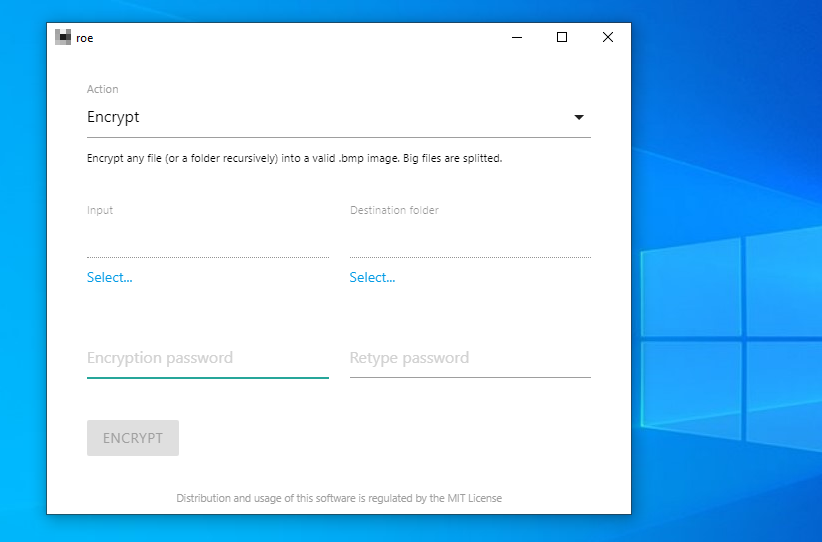
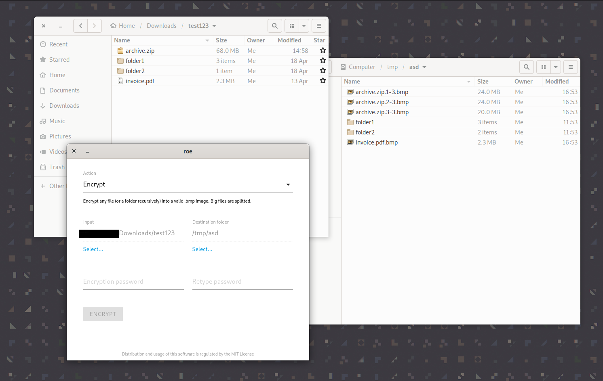

# roe

**roe** is a tool for encrypting any file into a valid **.bmp** image.<br>
Available for Windows, macOS and Linux.

<hr>

## Download

Latest release for Windows: 
  [gui](https://github.com/topac/roe/releases/download/v0.0.1/roe-gui-windows-ia32.zip),
  [cli](https://github.com/topac/roe/releases/download/v0.0.1/roe-cli-windows-386.zip).<br>
Latest release for macOS: 
  [gui](https://github.com/topac/roe/releases/download/v0.0.1/roe-gui-darwin-x64.zip), 
  [cli](https://github.com/topac/roe/releases/download/v0.0.1/roe-cli-darwin-amd64.zip).<br>
Latest release for Linux: 
  [gui](https://github.com/topac/roe/releases/download/v0.0.1/roe-gui-linux-x64.zip), 
  [cli](https://github.com/topac/roe/releases/download/v0.0.1/roe-cli-linux-amd64.zip).<br>

## Screenshots



[](./screenshots/screenshot2.png) 
[](./screenshots/screenshot3.png)

## Build

To build the command-line version, install Go (version >= 1.13), clone this repository, then run the following commands:

```bash
  cd roe/pkg
  go build -o roecli cmd/roecli/*.go
  ./roecli --help
```

To run the graphical version, install Node.js (and npm), then run the following commands:

```bash
  cd roe/gui
  npm install
  sh copy-roe-cli.sh
  npx electromon .
```
